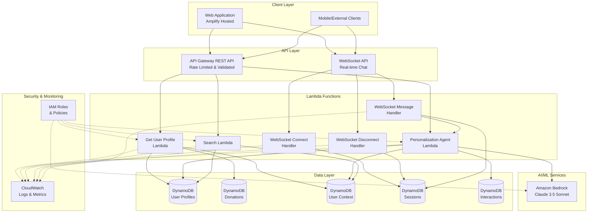

# Supporter Engagement Platform - Current Architecture

## High-Level Architecture



## Component Details

### API Gateway REST API
- **Endpoints:**
  - `GET /profile?userId={userId}` - Get user profile by query parameter
  - `GET /profile/{userId}` - Get user profile by path parameter
  - `POST /agent` - Interact with personalization agent
  - `POST /search` - Search for content and recommendations
- **Features:**
  - Request validation (body & parameters)
  - CORS enabled for all origins
  - Rate limiting: 100 req/s, burst 200
  - API Key authentication
  - Usage plan: 10,000 requests/day

### WebSocket API
- **Routes:**
  - `$connect` - Establish WebSocket connection
  - `$disconnect` - Close WebSocket connection
  - `$default` - Handle incoming messages
- **Features:**
  - Real-time bidirectional communication
  - Session management via DynamoDB
  - Rate limiting: 100 req/s, burst 200

### Lambda Functions

#### 1. Get User Profile
- **Runtime:** Node.js 20.x
- **Memory:** 512 MB
- **Timeout:** 30 seconds
- **Purpose:** Retrieve user profile, donation history, and context

#### 2. Personalization Agent
- **Runtime:** Node.js 20.x
- **Memory:** 1024 MB
- **Timeout:** 60 seconds
- **Purpose:** AI-powered personalized content generation using Bedrock
- **Model:** Claude 3.5 Sonnet v2

#### 3. Search
- **Runtime:** Node.js 20.x
- **Memory:** 512 MB
- **Timeout:** 30 seconds
- **Purpose:** Search knowledge articles and research papers

#### 4. WebSocket Handlers
- **Runtime:** Node.js 20.x (inline code)
- **Memory:** 256 MB (Connect/Disconnect), 1024 MB (Message)
- **Timeout:** 10 seconds (Connect/Disconnect), 60 seconds (Message)
- **Purpose:** Manage WebSocket connections and route messages

### DynamoDB Tables

#### 1. User Profiles Table
- **Name:** `SupporterEngagement-Users`
- **Partition Key:** `userId` (String)
- **Purpose:** Store user profile information, preferences, and engagement history

#### 2. Donations Table
- **Name:** `SupporterEngagement-Donations`
- **Partition Key:** `userId` (String)
- **Sort Key:** `donationId` (String)
- **Purpose:** Track donation history and financial contributions

#### 3. User Context Table
- **Name:** `SupporterEngagement-Context`
- **Partition Key:** `userId` (String)
- **Sort Key:** `version` (Number)
- **Purpose:** Maintain versioned user context for personalization

#### 4. Sessions Table
- **Name:** `SupporterEngagement-Sessions`
- **Partition Key:** `sessionId` (String)
- **TTL:** Enabled (1 hour)
- **Purpose:** Manage WebSocket connections and session state

#### 5. Interactions Table
- **Name:** `SupporterEngagement-Interactions`
- **Partition Key:** `userId` (String)
- **Sort Key:** `timestamp` (String)
- **Purpose:** Log all user interactions for analytics

### Security Features
- **Encryption:** All DynamoDB tables use AWS-managed encryption
- **IAM Roles:** Least-privilege access for Lambda functions
- **Bedrock Access:** Scoped to specific foundation models
- **Point-in-Time Recovery:** Enabled on all tables
- **CloudWatch Logging:** Full request/response logging for debugging

### Monitoring & Observability
- **API Gateway:** Metrics, throttling, and access logs
- **Lambda:** CloudWatch Logs with execution metrics
- **DynamoDB:** Performance metrics and capacity monitoring
- **Bedrock:** Model invocation tracking

## Data Flow Examples

### 1. User Profile Retrieval
```
Client → API Gateway → Get Profile Lambda → User Profiles Table → Response
```

### 2. Personalized Content Generation
```
Client → API Gateway → Personalization Agent Lambda → Bedrock (Claude) → User Context Table → Response
```

### 3. Real-time Chat
```
Client → WebSocket API → Message Handler → Personalization Agent → Bedrock → WebSocket Response
```

## Deployment Information
- **Region:** us-west-2
- **Stack Name:** SupporterEngagementStack
- **Infrastructure as Code:** AWS CDK (TypeScript)
- **Lambda Build:** Local TypeScript compilation to dist/
