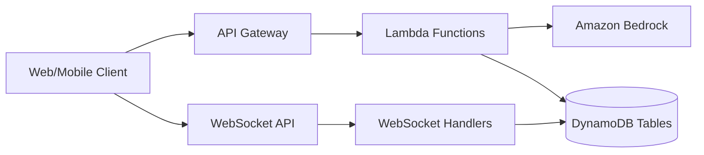
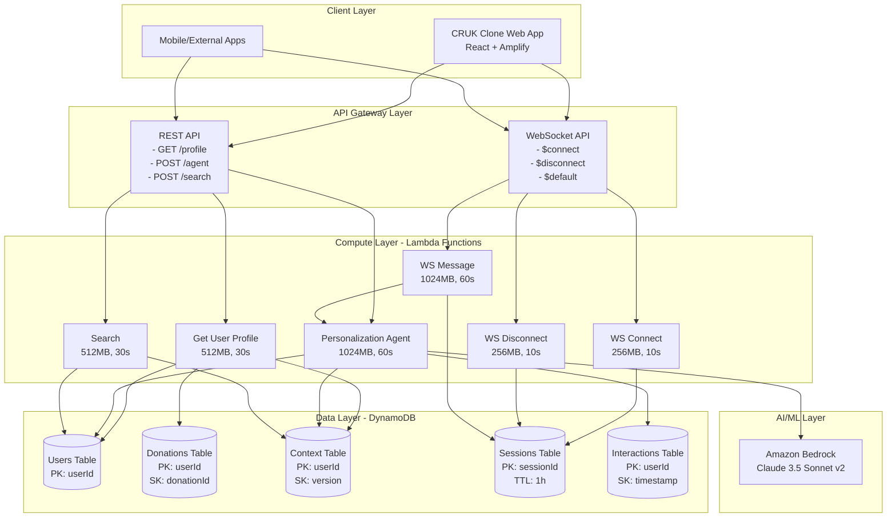
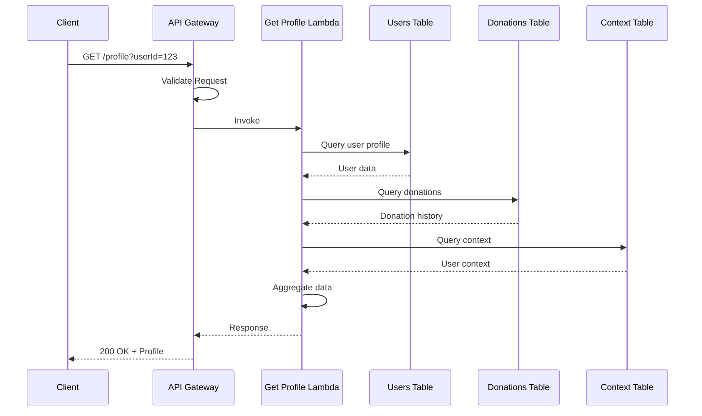
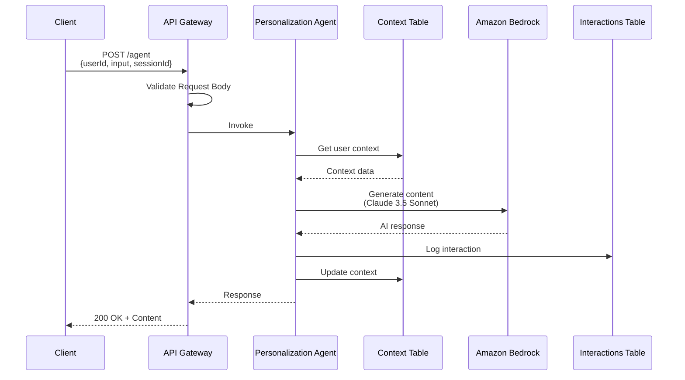
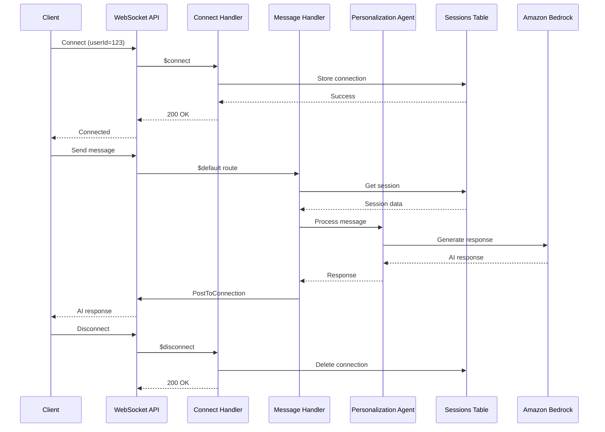
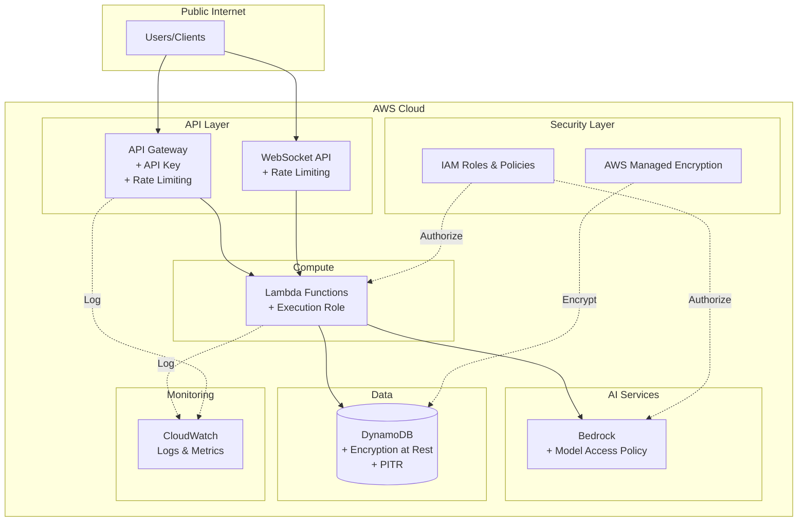
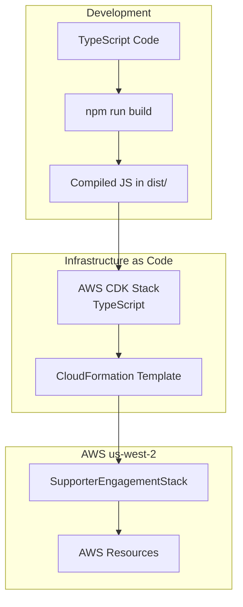

# Supporter Engagement Platform Architecture Diagrams

## 1. System Overview

## 2. Detailed Component Architecture

## 3. Data Flow - User Profile Retrieval

## 4. Data Flow - Personalized Content Generation

## 5. Data Flow - Real-time Chat via WebSocket

## 6. Security Architecture

## 7. Deployment Architecture

## Key Architecture Decisions

### 1. Serverless Architecture
- **Why:** Cost-effective, auto-scaling, pay-per-use
- **Components:** Lambda, API Gateway, DynamoDB

### 2. Amazon Bedrock for AI
- **Model:** Claude 3.5 Sonnet v2
- **Why:** State-of-the-art language understanding, no model management

### 3. DynamoDB for Data Storage
- **Why:** Serverless, low-latency, flexible schema
- **Tables:** Separate tables for different data types with appropriate keys

### 4. WebSocket for Real-time Communication
- **Why:** Bidirectional, low-latency chat experience
- **Implementation:** API Gateway WebSocket API + Lambda handlers

### 5. Local Lambda Build
- **Why:** Avoid Docker dependency, faster builds
- **Process:** TypeScript → JavaScript compilation → dist/ folder

### 6. API Gateway Request Validation
- **Why:** Reduce Lambda invocations, improve security
- **Features:** JSON schema validation, parameter validation

## Performance Characteristics

| Component | Latency | Throughput | Cost Model |
|-----------|---------|------------|------------|
| API Gateway | <10ms | 100 req/s (configurable) | Per request |
| Lambda (Get Profile) | 50-200ms | Auto-scaling | Per 100ms |
| Lambda (Agent) | 1-5s | Auto-scaling | Per 100ms |
| DynamoDB | <10ms | On-demand | Per request |
| Bedrock | 1-3s | Model-dependent | Per token |
| WebSocket | <50ms | 100 req/s (configurable) | Per message |

## Scalability

- **API Gateway:** Handles 10,000 requests/second by default
- **Lambda:** Concurrent executions scale automatically (default 1000)
- **DynamoDB:** On-demand capacity scales automatically
- **Bedrock:** Managed service with automatic scaling

## Monitoring & Observability

- **CloudWatch Logs:** All Lambda function logs
- **CloudWatch Metrics:** API Gateway, Lambda, DynamoDB metrics
- **X-Ray:** Distributed tracing (can be enabled)
- **API Gateway Access Logs:** Full request/response logging
