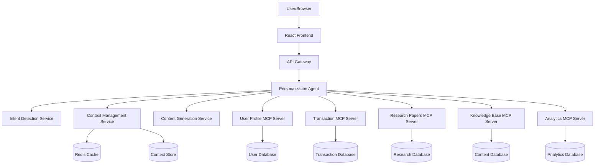

# Design Document: Supporter Engagement Platform

## Overview

The Supporter Engagement Platform is an AI-powered system that provides personalized supporter experiences and information seeking capabilities for Cancer Research UK. The system uses a conversational AI agent architecture with Model Context Protocol (MCP) servers to access real-time data from multiple backend sources. The platform detects user intent, maintains context across sessions, and delivers tailored content that inspires deeper engagement with CRUK's mission.

The architecture follows an agentic pattern where a central AI orchestrator (the Personalization Engine) coordinates between multiple specialized MCP servers, each responsible for specific data domains. This design enables low-latency responses, cost optimization through selective data retrieval, and maintainable separation of concerns.

## Architecture

### High-Level Architecture



### Component Architecture

The system is organized into three primary layers:

1. **Presentation Layer**: React-based frontend with personalization containers and search interface
2. **Orchestration Layer**: AI agent that coordinates intent detection, context management, and content generation
3. **Data Layer**: MCP servers providing access to specialized data sources

### Technology Stack

- **Frontend**: React with TypeScript, AWS Amplify for hosting
- **Backend**: AWS Lambda functions (Node.js/TypeScript) for API endpoints
- **AI/LLM**: Amazon Bedrock with Claude 3.5 Sonnet for conversational AI
- **MCP Servers**: Node.js/TypeScript services implementing MCP protocol
- **Data Storage**: 
  - Amazon DynamoDB for user profiles and context
  - Amazon RDS for transactional data
  - Amazon S3 for research papers and content
  - Amazon ElastiCache (Redis) for session caching
- **API Gateway**: AWS API Gateway with WebSocket support for real-time interactions
- **Authentication**: Amazon Cognito for user authentication and authorization

## Components and Interfaces

### 1. Personalization Agent

The central orchestrator that manages all user interactions and coordinates between services.

**Responsibilities:**
- Receive user input and route to appropriate services
- Maintain conversation state and context
- Coordinate calls to MCP servers
- Generate responses using LLM
- Manage personalization flow state machine

**Interface:**
```typescript
interface PersonalizationAgent {
  // Process user input and return response
  processInput(userId: string, input: UserInput, sessionId: string): Promise<AgentResponse>;
  
  // Initialize new user session
  initializeSession(userId: string): Promise<SessionContext>;
  
  // Resume existing session
  resumeSession(sessionId: string): Promise<SessionContext>;
  
  // End session and persist context
  endSession(sessionId: string): Promise<void>;
}

interface UserInput {
  text: string;
  timestamp: Date;
  metadata?: Record<string, any>;
}

interface AgentResponse {
  text: string;
  uiComponents?: UIComponent[];
  nextAction?: string;
  requiresUserInput: boolean;
}
```

### 2. Intent Detection Service

Analyzes user input to determine whether the user wants personalization or information seeking.

**Responsibilities:**
- Classify user intent (personalization, information_seeking, action, unclear)
- Extract entities from user input
- Provide confidence scores for intent classification

**Interface:**
```typescript
interface IntentDetectionService {
  detectIntent(input: string, context: UserContext): Promise<IntentResult>;
}

interface IntentResult {
  primaryIntent: 'personalization' | 'information_seeking' | 'action' | 'unclear';
  confidence: number;
  entities: Entity[];
  suggestedFlow: string;
}

interface Entity {
  type: string;
  value: string;
  confidence: number;
}
```

### 3. Context Management Service

Maintains user context across sessions and manages the context store.

**Responsibilities:**
- Store and retrieve user context
- Merge new context with existing context
- Manage context versioning with timestamps
- Cache frequently accessed context

**Interface:**
```typescript
interface ContextManagementService {
  getContext(userId: string): Promise<UserContext>;
  updateContext(userId: string, updates: Partial<UserContext>): Promise<UserContext>;
  mergeContext(userId: string, newContext: Partial<UserContext>): Promise<UserContext>;
  getContextHistory(userId: string, limit?: number): Promise<ContextVersion[]>;
}

interface UserContext {
  userId: string;
  profile: UserProfile;
  engagementHistory: EngagementRecord[];
  preferences: UserPreferences;
  currentFlow?: FlowState;
  lastUpdated: Date;
  version: number;
}

interface ContextVersion {
  version: number;
  context: UserContext;
  timestamp: Date;
  source: string;
}
```

### 4. Content Generation Service

Generates personalized content including motivational messages and calls to action.

**Responsibilities:**
- Generate motivational content based on user context
- Create personalized calls to action
- Format content for display
- Select relevant research papers and achievements

**Interface:**
```typescript
interface ContentGenerationService {
  generateMotivationalContent(context: UserContext): Promise<MotivationalContent>;
  generateCallToAction(context: UserContext): Promise<CallToAction>;
  selectResearchPapers(context: UserContext, limit: number): Promise<ResearchPaper[]>;
  formatImpactBreakdown(donations: Donation[]): Promise<ImpactBreakdown>;
}

interface MotivationalContent {
  headline: string;
  body: string;
  achievements: Achievement[];
  personalizedMessage: string;
}

interface CallToAction {
  type: 'donate' | 'volunteer' | 'fundraise' | 'campaign';
  title: string;
  description: string;
  suggestedAmounts?: number[];
  actionUrl: string;
}
```

### 5. MCP Server: User Profile

Provides access to user profile data including demographics, engagement history, and preferences.

**MCP Tools:**
```typescript
// Get user profile
tool: "get_user_profile"
input: { userId: string }
output: UserProfile

// Update user profile
tool: "update_user_profile"
input: { userId: string, updates: Partial<UserProfile> }
output: UserProfile

// Get engagement history
tool: "get_engagement_history"
input: { userId: string, limit?: number }
output: EngagementRecord[]
```

### 6. MCP Server: Transaction

Provides real-time access to donation and transaction data.

**MCP Tools:**
```typescript
// Get recent transactions
tool: "get_recent_transactions"
input: { userId: string, limit?: number }
output: Transaction[]

// Validate transaction
tool: "validate_transaction"
input: { transactionId: string }
output: TransactionValidation

// Get donation summary
tool: "get_donation_summary"
input: { userId: string }
output: DonationSummary
```

### 7. MCP Server: Research Papers

Provides access to CRUK's published research papers.

**MCP Tools:**
```typescript
// Search research papers
tool: "search_research_papers"
input: { query?: string, tags?: string[], limit?: number }
output: ResearchPaper[]

// Get featured papers
tool: "get_featured_papers"
input: { limit?: number }
output: ResearchPaper[]

// Get paper by ID
tool: "get_paper"
input: { paperId: string }
output: ResearchPaper
```

### 8. MCP Server: Knowledge Base

Provides access to CRUK's published cancer information content.

**MCP Tools:**
```typescript
// Search knowledge base
tool: "search_knowledge_base"
input: { query: string, filters?: SearchFilters }
output: KnowledgeArticle[]

// Get article by ID
tool: "get_article"
input: { articleId: string }
output: KnowledgeArticle

// Get related articles
tool: "get_related_articles"
input: { articleId: string, limit?: number }
output: KnowledgeArticle[]
```

### 9. MCP Server: Analytics

Tracks user interactions and provides analytics data.

**MCP Tools:**
```typescript
// Record interaction
tool: "record_interaction"
input: { userId: string, interaction: Interaction }
output: { success: boolean }

// Get user analytics
tool: "get_user_analytics"
input: { userId: string }
output: UserAnalytics

// Record page visit
tool: "record_page_visit"
input: { userId: string, pageUrl: string, timestamp: Date }
output: { success: boolean }
```

## Data Models

### UserProfile

```typescript
interface UserProfile {
  userId: string;
  email: string;
  name: string;
  age?: number;
  gender?: string;
  location?: string;
  
  // Engagement attributes
  totalDonations: number;
  donationCount: number;
  firstDonationDate?: Date;
  lastDonationDate?: Date;
  
  // Activity flags
  hasAttendedEvents: boolean;
  hasFundraised: boolean;
  hasVolunteered: boolean;
  isResearcher: boolean;
  isJournalist: boolean;
  isPhilanthropist: boolean;
  
  // Personal context
  personallyAffected: boolean;
  lovedOneAffected: boolean;
  cancerType?: string;
  
  // Preferences
  communicationPreferences: CommunicationPreferences;
  interests: string[];
  
  // Metadata
  createdAt: Date;
  updatedAt: Date;
  consentGiven: boolean;
  consentDate?: Date;
}

interface CommunicationPreferences {
  email: boolean;
  sms: boolean;
  phone: boolean;
  preferredFrequency: 'weekly' | 'monthly' | 'quarterly';
}
```

### SessionContext

```typescript
interface SessionContext {
  sessionId: string;
  userId: string;
  startTime: Date;
  lastActivityTime: Date;
  
  // Flow state
  currentFlow: 'personalization' | 'information_seeking' | 'idle';
  flowState: FlowState;
  
  // Conversation history
  messages: Message[];
  
  // Cached data
  cachedProfile?: UserProfile;
  cachedContext?: UserContext;
}

interface FlowState {
  flowType: string;
  currentStep: string;
  completedSteps: string[];
  collectedData: Record<string, any>;
  canResume: boolean;
}

interface Message {
  role: 'user' | 'assistant' | 'system';
  content: string;
  timestamp: Date;
  metadata?: Record<string, any>;
}
```

### EngagementRecord

```typescript
interface EngagementRecord {
  recordId: string;
  userId: string;
  type: 'donation' | 'event' | 'volunteer' | 'fundraise' | 'campaign';
  timestamp: Date;
  
  // Type-specific data
  donationAmount?: number;
  eventName?: string;
  campaignName?: string;
  
  // Impact
  impactDescription?: string;
  
  metadata: Record<string, any>;
}
```

### Transaction

```typescript
interface Transaction {
  transactionId: string;
  userId: string;
  type: 'one_time' | 'recurring';
  amount: number;
  currency: string;
  status: 'pending' | 'completed' | 'failed';
  timestamp: Date;
  paymentMethod: string;
  
  // Campaign association
  campaignId?: string;
  
  metadata: Record<string, any>;
}

interface DonationSummary {
  userId: string;
  totalAmount: number;
  transactionCount: number;
  averageAmount: number;
  recurringDonations: number;
  lastDonationDate?: Date;
  suggestedNextAmount: number;
}
```

### ResearchPaper

```typescript
interface ResearchPaper {
  paperId: string;
  title: string;
  authors: string[];
  journal: string;
  publicationDate: Date;
  abstract: string;
  url: string;
  
  // Categorization
  tags: string[];
  cancerTypes: string[];
  researchArea: string;
  
  // Impact metrics
  citations: number;
  impactFactor?: number;
  isFeatured: boolean;
  
  // CRUK specific
  fundedByCRUK: boolean;
  fundingAmount?: number;
}
```

### KnowledgeArticle

```typescript
interface KnowledgeArticle {
  articleId: string;
  title: string;
  summary: string;
  content: string;
  url: string;
  
  // Categorization
  category: string;
  tags: string[];
  cancerTypes: string[];
  
  // Metadata
  publishedDate: Date;
  lastUpdated: Date;
  author: string;
  
  // Accessibility
  readingLevel: 'basic' | 'intermediate' | 'advanced';
  availableLanguages: string[];
}
```

### UIComponent

```typescript
interface UIComponent {
  type: 'dashboard' | 'search_results' | 'call_to_action' | 'info_card' | 'donation_widget';
  data: Record<string, any>;
  layout?: LayoutConfig;
}

interface DashboardData {
  userName: string;
  totalDonations: number;
  currentCampaign?: CampaignProgress;
  impactBreakdown: ImpactItem[];
  recommendedPages: PageRecommendation[];
  featuredResearch: ResearchPaper[];
}

interface CampaignProgress {
  campaignName: string;
  currentAmount: number;
  targetAmount: number;
  percentComplete: number;
}

interface ImpactItem {
  description: string;
  quantity: number;
  icon: string;
}

interface PageRecommendation {
  title: string;
  url: string;
  reason: string;
  thumbnail?: string;
}
```

## Correctness Properties

*A property is a characteristic or behavior that should hold true across all valid executions of a system—essentially, a formal statement about what the system should do. Properties serve as the bridge between human-readable specifications and machine-verifiable correctness guarantees.*


### Property 1: Profile Retrieval on Authentication
*For any* successful user authentication, the system should retrieve the user profile from the MCP server including all user attributes (donation history, event participation, personal circumstances).
**Validates: Requirements 1.2, 1.6**

### Property 2: Flow Selection Based on Profile State
*For any* user profile, the system should select the appropriate flow: Dashboard for profiles with engagement context, simplified personalization flow for profiles with only basic information, and new user flow for profiles with no context.
**Validates: Requirements 1.3, 1.4, 1.5**

### Property 3: Dashboard Completeness
*For any* dashboard display, the system should show all required components: user name, total donations, impact breakdown, recommended pages, and featured research papers. If an active campaign exists, it should also display campaign progress.
**Validates: Requirements 2.1, 2.2, 2.3, 2.4, 2.5, 10.1, 10.2, 10.3**

### Property 4: Personalization Input Round-Trip
*For any* personalization input provided by a user, the system should summarize it, confirm accuracy with the user, and upon confirmation, save it with a timestamp such that future retrievals return the same information.
**Validates: Requirements 3.2, 3.3, 3.4, 3.5, 9.1**

### Property 5: Intent Detection Universality
*For any* user query, the system should detect an intent classification (personalization, information_seeking, action, or unclear) and route to the appropriate flow.
**Validates: Requirements 4.1, 4.2**

### Property 6: Flow Transition Protocol
*For any* completed information seeking flow, the system should ask to resume personalization flow. For any user request to stop personalization, the system should pause and respect the choice.
**Validates: Requirements 4.3, 4.4**

### Property 7: Interaction Recording Completeness
*For any* user interaction, the system should record the user intent, and for information seeking interactions, should also record the request details.
**Validates: Requirements 4.5, 5.5**

### Property 8: CRUK Source Exclusivity
*For any* information request or search query, all returned results (links, articles, content) should exclusively come from Cancer Research UK's verified published sources.
**Validates: Requirements 5.1, 5.6, 12.2, 12.5**

### Property 9: Information Seeking Feedback Loop
*For any* information provision, the system should validate completeness with the user, gather sentiment feedback, and then ask to resume personalization flow.
**Validates: Requirements 5.2, 5.3, 5.4**

### Property 10: Motivational Content Personalization
*For any* motivational content generation, the content should be tailored based on user context and include relevant CRUK achievements and research papers matching the supporter's interests.
**Validates: Requirements 6.1, 6.2, 6.3**

### Property 11: Call to Action Personalization
*For any* call to action generation, the recommendation should be tailored based on user context (skills, location, interests) and donation amounts should be based on previous behavior.
**Validates: Requirements 7.1, 7.2, 7.4**

### Property 12: Regular Giving CTA for Capable Supporters
*For any* supporter with capacity for regular giving, the system should present "become a regular giver" as a call to action option.
**Validates: Requirements 7.3**

### Property 13: MCP Server Integration Completeness
*For any* authenticated user session, the system should successfully call MCP servers to retrieve profile data, and for any specific data request (transactions, research papers, page visits), the appropriate MCP server should be called.
**Validates: Requirements 8.1, 8.2, 8.3, 8.4**

### Property 14: Graceful Error Handling
*For any* MCP server call failure, the system should handle the error gracefully without crashing and inform the user of the issue.
**Validates: Requirements 8.5**

### Property 15: Context Versioning and Retrieval
*For any* user context update, the system should store it in structured format, and for any context retrieval, the system should return the most recent version.
**Validates: Requirements 9.2, 9.3**

### Property 16: Interaction History Persistence
*For any* user interaction, the system should add it to the interaction history including intent and sentiment, and this history should be maintained across sessions.
**Validates: Requirements 9.4, 9.5**

### Property 17: Session Context Round-Trip
*For any* user session that ends and later resumes, the user context should be preserved and restored, maintaining continuity of the personalization experience.
**Validates: Requirements 9.5**

### Property 18: Missing Data Graceful Handling
*For any* user profile with missing data, the system should display appropriate questions for the missing fields (including age and gender where applicable) and provide a search bar, but should not block access to other features.
**Validates: Requirements 11.1, 11.2, 11.3, 11.4**

### Property 19: Search Bar Ubiquity
*For any* page or view in the system, a free text search bar with the prompt "what are you looking for today" should be displayed.
**Validates: Requirements 12.1**

### Property 20: Search Results Completeness
*For any* search results display, the system should provide clickable links to relevant CRUK pages and articles, and should record the search query in user context.
**Validates: Requirements 12.3, 12.4**

### Property 21: Consent Verification for Sensitive Data
*For any* operation that processes special category personal data, the system should verify that appropriate consent is in place before proceeding.
**Validates: Requirements 13.1**

### Property 22: Data Encryption Universality
*For any* sensitive user data operation (storage or transmission), the data should be encrypted using appropriate encryption standards.
**Validates: Requirements 13.2**

### Property 23: Data Access Rights
*For any* user, the system should provide accessible mechanisms to view, modify, and delete their personal data.
**Validates: Requirements 13.4**

### Property 24: Audit Logging Completeness
*For any* data access or modification operation, the system should create an audit log entry with timestamp, user, and operation details.
**Validates: Requirements 13.5**

### Property 25: Response Time Performance
*For any* user query under normal load, the system should respond within 2 seconds.
**Validates: Requirements 14.1**

### Property 26: Cache Effectiveness
*For any* frequently accessed data (accessed more than N times in M minutes), the system should cache it to reduce MCP server calls.
**Validates: Requirements 14.3**

### Property 27: Load Performance Maintenance
*For any* system state including high load conditions, the system should maintain acceptable response times (within defined SLA thresholds).
**Validates: Requirements 14.5**

## Error Handling

### Error Categories

1. **MCP Server Errors**
   - Connection failures
   - Timeout errors
   - Invalid responses
   - Authorization failures

2. **User Input Errors**
   - Invalid format
   - Missing required fields
   - Malformed queries

3. **System Errors**
   - LLM failures
   - Cache failures
   - Database errors
   - Authentication errors

### Error Handling Strategy

**Graceful Degradation:**
- If MCP server fails, use cached data when available
- If LLM fails, fall back to template-based responses
- If personalization fails, provide generic experience

**User Communication:**
- Clear, non-technical error messages
- Suggested actions for recovery
- Option to retry or continue with limited functionality

**Logging and Monitoring:**
- All errors logged with context
- Critical errors trigger alerts
- Error rates monitored for system health

**Retry Logic:**
- Exponential backoff for transient failures
- Maximum retry attempts: 3
- Circuit breaker pattern for persistent failures

### Error Response Format

```typescript
interface ErrorResponse {
  error: {
    code: string;
    message: string;
    userMessage: string;
    suggestedAction?: string;
    retryable: boolean;
  };
  fallbackData?: any;
}
```

## Testing Strategy

### Dual Testing Approach

The system will be validated using both unit tests and property-based tests, which are complementary and necessary for comprehensive coverage:

- **Unit tests**: Verify specific examples, edge cases, and error conditions
- **Property tests**: Verify universal properties across all inputs

### Unit Testing

Unit tests will focus on:
- Specific examples that demonstrate correct behavior
- Integration points between components
- Edge cases (empty inputs, boundary values, null handling)
- Error conditions and graceful degradation
- Mock MCP server responses

**Testing Framework**: Jest with TypeScript
**Coverage Target**: 80% code coverage minimum

### Property-Based Testing

Property-based tests will validate the correctness properties defined above using randomized inputs.

**Testing Framework**: fast-check (JavaScript/TypeScript property-based testing library)

**Configuration**:
- Minimum 100 iterations per property test
- Each test tagged with feature name and property number
- Tag format: `Feature: supporter-engagement-platform, Property {number}: {property_text}`

**Test Organization**:
```
tests/
  unit/
    agent/
      personalization-agent.test.ts
      intent-detection.test.ts
      context-management.test.ts
    mcp/
      user-profile-server.test.ts
      transaction-server.test.ts
  properties/
    authentication.property.test.ts
    personalization.property.test.ts
    information-seeking.property.test.ts
    data-persistence.property.test.ts
    security.property.test.ts
    performance.property.test.ts
```

**Example Property Test Structure**:
```typescript
// Feature: supporter-engagement-platform, Property 1: Profile Retrieval on Authentication
describe('Property 1: Profile Retrieval on Authentication', () => {
  it('should retrieve user profile for any successful authentication', async () => {
    await fc.assert(
      fc.asyncProperty(
        fc.record({
          userId: fc.uuid(),
          email: fc.emailAddress(),
          password: fc.string({ minLength: 8 })
        }),
        async (credentials) => {
          // Authenticate user
          const authResult = await authenticateUser(credentials);
          expect(authResult.success).toBe(true);
          
          // Verify profile retrieval
          const profile = await getProfile(credentials.userId);
          expect(profile).toBeDefined();
          expect(profile.userId).toBe(credentials.userId);
          expect(profile).toHaveProperty('donationHistory');
          expect(profile).toHaveProperty('eventParticipation');
          expect(profile).toHaveProperty('personalCircumstances');
        }
      ),
      { numRuns: 100 }
    );
  });
});
```

### Integration Testing

Integration tests will verify:
- End-to-end user flows
- MCP server integration
- Frontend-backend communication
- Authentication and authorization
- Data persistence across sessions

### Performance Testing

Performance tests will validate:
- Response time requirements (Property 25)
- Load handling (Property 27)
- Cache effectiveness (Property 26)
- Concurrent user handling

**Tools**: Artillery for load testing, AWS CloudWatch for monitoring

### Security Testing

Security tests will verify:
- GDPR compliance (Properties 21, 23)
- Data encryption (Property 22)
- Audit logging (Property 24)
- Input validation and sanitization
- Authentication and authorization

**Tools**: OWASP ZAP for security scanning, custom security test suites

## Deployment Architecture

### AWS Services

- **Frontend**: AWS Amplify (React app hosting)
- **API**: AWS API Gateway (REST + WebSocket)
- **Compute**: AWS Lambda (Node.js functions)
- **AI**: Amazon Bedrock (Claude 3.5 Sonnet)
- **Storage**:
  - Amazon DynamoDB (user profiles, context)
  - Amazon RDS PostgreSQL (transactions, analytics)
  - Amazon S3 (research papers, content)
- **Cache**: Amazon ElastiCache (Redis)
- **Auth**: Amazon Cognito
- **Monitoring**: AWS CloudWatch, AWS X-Ray
- **Secrets**: AWS Secrets Manager

### Environment Configuration

- **Development**: Single region, minimal resources
- **Staging**: Production-like, reduced capacity
- **Production**: Multi-AZ, auto-scaling, full monitoring

### CI/CD Pipeline

1. **Code Commit** → GitHub
2. **Build & Test** → GitHub Actions
   - Run unit tests
   - Run property tests (100 iterations)
   - Run integration tests
   - Security scanning
3. **Deploy to Staging** → AWS CDK
4. **Smoke Tests** → Automated validation
5. **Deploy to Production** → AWS CDK with approval
6. **Post-Deployment Tests** → Validation and monitoring

## Security Considerations

### Data Protection

- **Encryption at Rest**: AES-256 for all stored data
- **Encryption in Transit**: TLS 1.3 for all communications
- **Key Management**: AWS KMS for encryption keys
- **Data Classification**: Special category data flagged and protected

### Access Control

- **Authentication**: Amazon Cognito with MFA support
- **Authorization**: Role-based access control (RBAC)
- **API Security**: API keys, rate limiting, request validation
- **MCP Security**: Mutual TLS for MCP server communication

### Compliance

- **GDPR**: Right to access, rectify, erase, data portability
- **Audit Trail**: All data operations logged
- **Consent Management**: Explicit consent tracking
- **Data Retention**: Configurable retention policies

### Monitoring and Alerting

- **Security Events**: Failed authentication, unauthorized access
- **Data Access**: Unusual patterns, bulk exports
- **System Health**: Error rates, response times, availability
- **Compliance**: Audit log completeness, consent verification

## Scalability Considerations

### Horizontal Scaling

- **Lambda Functions**: Auto-scaling based on demand
- **API Gateway**: Handles millions of requests
- **DynamoDB**: On-demand capacity mode
- **ElastiCache**: Redis cluster mode

### Performance Optimization

- **Caching Strategy**:
  - User profiles: 5-minute TTL
  - Research papers: 1-hour TTL
  - Knowledge articles: 1-hour TTL
  - Session data: Session lifetime

- **Database Optimization**:
  - Indexed queries for fast lookups
  - Read replicas for analytics
  - Connection pooling

- **LLM Optimization**:
  - Prompt caching for repeated patterns
  - Streaming responses for better UX
  - Model selection based on complexity

### Cost Optimization

- **Lambda**: Right-sized memory allocation
- **DynamoDB**: On-demand for variable load
- **S3**: Lifecycle policies for old content
- **ElastiCache**: Right-sized cluster
- **Bedrock**: Model selection, prompt optimization

## Future Enhancements

1. **Multilingual Support**: Extend to support multiple languages for diverse audiences
2. **Voice Interface**: Add voice input/output for accessibility
3. **Mobile App**: Native mobile applications for iOS and Android
4. **Advanced Analytics**: Predictive models for supporter lifetime value
5. **A/B Testing**: Framework for testing personalization strategies
6. **Offline Support**: Progressive web app with offline capabilities
7. **Integration Expansion**: Connect to more CRUK systems and data sources
